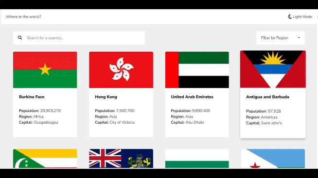

# Overview

### REST Countries API with color theme switcher solution

This is a solution to the [REST Countries API with color theme switcher challenge on Frontend Mentor](https://www.frontendmentor.io/challenges/rest-countries-api-with-color-theme-switcher-5cacc469fec04111f7b848ca). Frontend Mentor challenges help you improve your coding skills by building realistic projects. 

### The challenge

Users should be able to:

- See all countries from the API on the homepage
- Search for a country using an `input` field
- Filter countries by region
- Click on a country to see more detailed information on a separate page
- Click through to the border countries on the detail page
- Toggle the color scheme between light and dark mode

### Screenshot

### Links

- Live Site URL: [rest-countries](https://lawrenceprieto.github.io/rest-countries)
- Solution URL: [rest-countries-solution](https://github.com/lawrenceprieto/rest-countries-app?search=1)

### Built with

- Semantic HTML5 markup
- CSS custom properties
- Flexbox
- Media querry
- Mobile-first workflow
- [React](https://reactjs.org/)
- [Vite](https://vitejs.dev/)
- [Bootsrap](https://getbootstrap.com/)
- [React Bootsrap](https://react-bootstrap.github.io/)
- [Rest Countries](https://restcountries.com/)